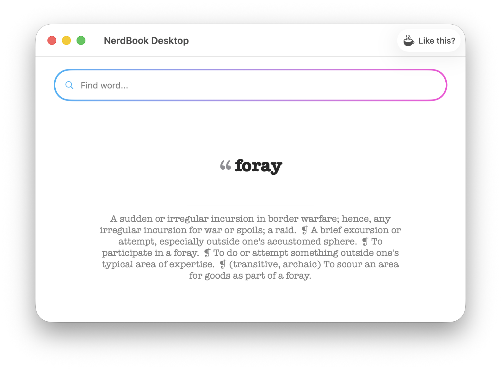
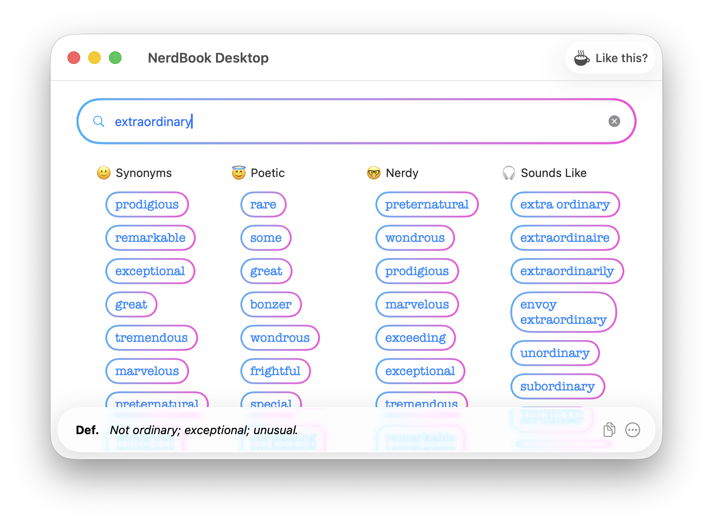

# NerdBook

A word explorer for writers, poets, and language nerds. NerdBook goes beyond a basic thesaurus — it finds synonyms, poetic alternatives, nerdy/pretentious words, and sound-alike matches, all in one view.





## What it does

The app greets you with a **word of the day** and definition. Then type any word and NerdBook instantly shows four columns of results:

- **Synonyms** — Standard synonyms ranked by relevance
- **Poetic** — Lyrical, literary alternatives for creative writing
- **Nerdy** — Pretentious, Latinate, and scholarly words for when you want to sound smart
- **Sounds Like** — Phonetically similar words, useful for rhyming, wordplay, and rap

Click the definition bar at the bottom to open a detail sheet with all definitions displayed as cards, plus a word cloud of associated/trigger words.

## Project structure

NerdBook is a single Xcode project that builds both a **macOS** and **iOS** app from shared code:

```
NerdBook/          # Mac app (SwiftUI + AppKit)
NerdBookiOS/       # iOS app (SwiftUI + UIKit)
Shared/            # Shared data layer, UI components, and logic
```

- `Shared/SharedData.swift` — `DataMuse` class handling all API calls and published state
- `Shared/SharedLogic.swift` — Shared UI components (ColorButton, FlowLayout, etc.)
- Each platform has its own `ContentView.swift` tailored to platform conventions

## API

Powered by [DataMuse](https://www.datamuse.com/) — a word-finding query engine used by millions of writers, developers, and linguists.

## Requirements

- Xcode 16+
- macOS 15+ / iOS 17+
- Swift 5.9+
